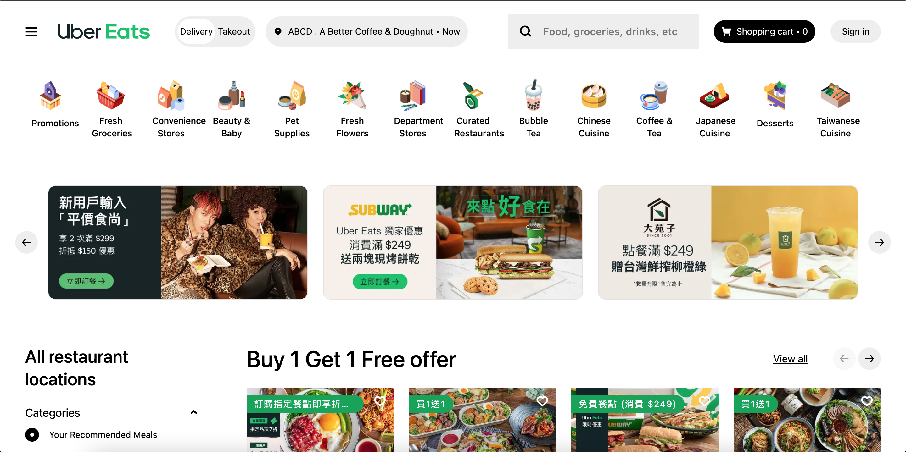
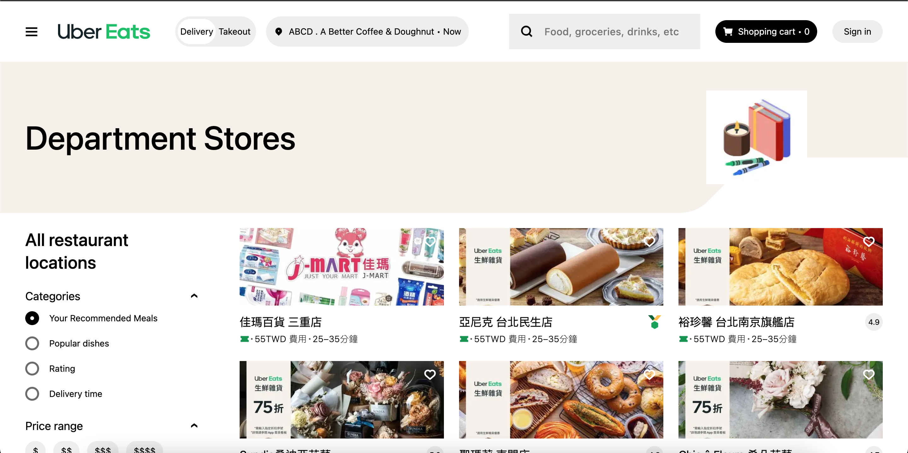
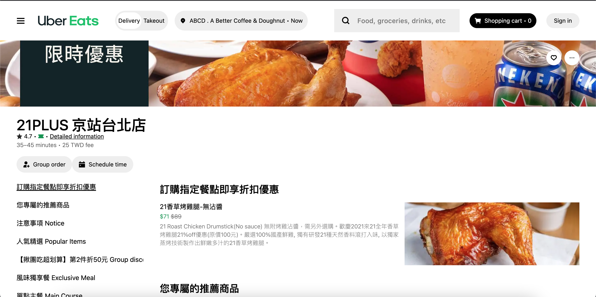

# UberEats Platform

[](https://ubereats-platform.vercel.app/)

A server-rendered UberEats clone (food-delivery browsing) built with the Next.js App Router and an Express + GraphQL + MySQL backend.

It exists as a portfolio piece, not a product. The interesting part is not the UI — it is the paper trail. Every architectural change in this repo was scoped as a deliberate migration with its own objective, prompt, and task breakdown under [`app/ai/`](app/ai). This README summarises the decisions and points you to where each one lives in the code. The data is sampled from UberEats Taiwan and used for learning purposes only.

## Preview





## Stack

Next.js 14 · TypeScript · React Query · graphql-request · Zod · Vitest · Playwright · SCSS Modules · Tailwind · Docker · GitHub Actions · Vercel · Render · Aiven

## Technical Decisions

**Next.js App Router (migrated from Pages Router).** The Pages Router version hand-rolled things the App Router does natively: a shared `getServerSideProps` wrapper for data fetching, `if` conditions to pick a layout per page, a separate `features/` tree (because everything under `pages/` became a route), and a manual `LocaleContext`. Moving to App Router deleted all four. The tradeoff accepted: a larger up-front migration in exchange for less bespoke routing/layout code to maintain. See [`app/ai/migrate-to-app-router/objective.md`](app/ai/migrate-to-app-router/objective.md).

**graphql-request + React Query (replaced Apollo Client).** Apollo's normalised cache is built for apps that mutate shared data across many components; this app is read-only, so that machinery was never used. Worse, a single Apollo client on the server risks leaking one request's cache into another's in the App Router. The replacement splits one opaque client into three explicit layers: `graphql-request` for transport only (no cache, safe in Server Components), React Query for client-side caching with intentional `staleTime`, and local state for UI-only concerns. Server and client deliberately do **not** share a `queryFn` — only the `queryKey` and Zod schema are shared, so each transport stays honest about where it runs. See [`app/ai/migrate-data-layer/objective.md`](app/ai/migrate-data-layer/objective.md); verify in [`app/api/graphql-client.ts`](app/api/graphql-client.ts), [`app/providers/query-client-provider.tsx`](app/providers/query-client-provider.tsx), and the co-located `queries.ts` files under `app/app/[locale]/`.

**Zod at the network boundary.** TypeScript types are erased at runtime and cannot catch server/client schema drift. GraphQL responses are parsed with Zod inside the `queryFn` (once, at the trust boundary — not re-parsed in components). See the same data-layer objective; verify in the `queries.ts` files.

**Local UI state kept out of the data cache.** UI-only state (carousel offset, channel pagination, restrict-search filters) has no server representation, so it never enters React Query. The data-layer objective specifies Zustand flat stores for this; the chosen rule is simply that server data and UI state are different layers and don't mix. See [`app/ai/migrate-data-layer/objective.md`](app/ai/migrate-data-layer/objective.md).

**Vitest + Playwright (replaced Jest + Cypress).** Jest needs Babel/CommonJS workarounds to cope with modern ESM Next.js tooling; Vitest uses Vite's native resolution and drops that config entirely. Cypress was swapped for Playwright for more reliable browser management in Docker/CI. See [`app/ai/migrate-test/objective.md`](app/ai/migrate-test/objective.md); config in [`app/vitest.config.ts`](app/vitest.config.ts) and [`app/playwright.config.ts`](app/playwright.config.ts).

**SCSS Modules + Tailwind.** Both are kept: SCSS Modules for component-scoped structural styling, Tailwind for utility classes. Tailwind's content/purge globs were narrowed to `app/` and `components/` after `features/` was dissolved. See [`app/ai/migrate-folder-structure/task.md`](app/ai/migrate-folder-structure/task.md).

**next-intl (App Router, v4).** Locale lives in the URL (`/en-US`, `/zh-TW`) via a `[locale]` segment and proxy, replacing the old manual cookie/context approach. `localePrefix: 'always'` keeps URLs explicit; `setRequestLocale` lets locale routes render statically. See [`app/ai/upgrade-nextjs-nextintl/objective.md`](app/ai/upgrade-nextjs-nextintl/objective.md); verify in [`app/i18n.ts`](app/i18n.ts), [`app/proxy.ts`](app/proxy.ts), [`app/i18n/request.ts`](app/i18n/request.ts).

## Architecture Highlights

**Rendering strategy is per-route, by intent.** The home page is dynamic (it was `getServerSideProps`). Category and marketing pages are statically generated with `dynamicParams = false` (a fixed, known set of slugs). Store pages are statically generated with `dynamicParams = true` so new stores render on demand (ISR-style fallback). Initial data is always prefetched on the server and hydrated into React Query — never fetched in `useEffect`. See [`app/ai/migrate-data-layer/task.md`](app/ai/migrate-data-layer/task.md); verify in the `page.tsx` files under `app/app/[locale]/`.

**No auth layer — by design.** The app is read-only browsing (no mutations, no user accounts), which is why Apollo's write-cache was dropped in the first place. There is intentionally nothing to authenticate. See [`app/ai/migrate-data-layer/objective.md`](app/ai/migrate-data-layer/objective.md).

**Server/client transport isolation.** The browser never talks to the internal GraphQL server directly. Client `useQuery` calls hit a same-origin proxy route, which forwards server-side; `gqlServerClient` is never imported into client code. See [`app/app/api/graphql/route.ts`](app/app/api/graphql/route.ts) and [`app/api/graphql-client.ts`](app/api/graphql-client.ts).

**Three-tier CI/CD split, shaped by free-tier limits.** `ci.yml` runs lint → unit (Vitest) → integration (full Docker Compose stack + Playwright E2E) on dev branches. `release.yml` (staging) builds and pushes the Express image to ghcr.io and deploys a Vercel preview — but deliberately does **not** redeploy Render, because Render's 750 free hours/month are reserved for the single production service. `main.yml` (production) additionally triggers the Render deploy hook. Render cold starts are mitigated by an external uptime ping. See [`app/ai/cicd-refactor/objective.md`](app/ai/cicd-refactor/objective.md); verify in [`.github/workflows/`](.github/workflows).

**Test strategy is layered with clear boundaries.** Unit tests (Vitest + Testing Library) cover components in isolation and run on every branch. Integration/E2E (Playwright against the real Docker Compose stack via nginx on port 80) runs in `ci.yml` only — not in release/main, because it needs the full stack booted. See [`app/ai/migrate-test/task.md`](app/ai/migrate-test/task.md); tests in [`app/e2e/`](app/e2e).

## Local Setup

Prerequisites: Docker + Docker Compose.

1. Copy env files:

```bash
cp app/.env.example app/.env.local
cp server/.env.example server/.env
```

2. Fill in the required values (see `.env.example` files for reference):

```bash
# app/.env.local
SERVER_URL=
SHORTCUT_ICONS_SERVER_HOST=
ADVERTISE_IMAGE_SERVER_HOST=
CATEGORY_ICONS_SERVER_HOST=
STORE_IMAGE_SERVER_HOST=
UTILS_ICONS_SERVER_HOST=
STAR_ICON_SERVER_HOST=
SPICY_ICON_SERVER_HOST=

# server/.env
SERVER_URL=
SHORTCUT_ICONS_SERVER_HOST=
ADVERTISE_IMAGE_SERVER_HOST=
CATEGORY_ICONS_SERVER_HOST=
STORE_IMAGE_SERVER_HOST=
UTILS_ICONS_SERVER_HOST=
STAR_ICON_SERVER_HOST=
SPICY_ICON_SERVER_HOST=
```

3. Start:

```bash
docker-compose build --no-cache && docker-compose up -d
```

The app is served by nginx at `http://localhost`.

## Deployment Architecture

Staging and production intentionally share one Render service and one Aiven database — acceptable for a portfolio, not for production-grade isolation. See [`app/ai/cicd-refactor/objective.md`](app/ai/cicd-refactor/objective.md).

| Layer   | Platform | How it deploys                                                          |
| ------- | -------- | ----------------------------------------------------------------------- |
| Next.js | Vercel   | Auto-deploy via Git integration (preview on `release*`, prod on `main`) |
| Express | Render   | Pulls the `ghcr.io` image; production only (triggered on `main`)        |
| MySQL   | Aiven    | Initialised manually once; shared across environments                   |
